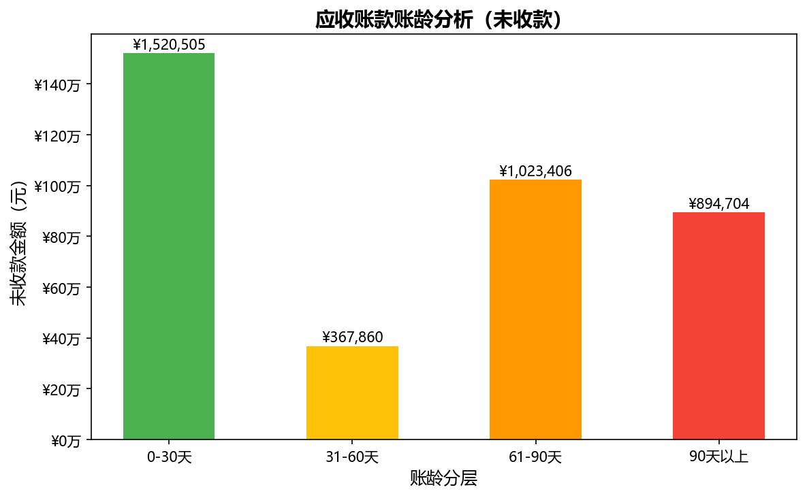

# 应收账款账龄分析工具

基于Python开发的应收账款账龄自动分析工具，模拟三大销售区域150+客户账款数据，
实现账龄自动分层、逾期风险识别及可视化报告输出。

## 项目背景

在企业财务工作中，应收账款管理涉及大量客户数据，人工在Excel中逐个计算账龄、
筛选逾期账款效率低且容易出错。本项目将这一过程完全自动化，一键生成带风险预警的完整报告。

## 功能模块

- **数据模拟**：生成华北、华东、华南三大区域24个客户的150+条发票记录
- **账龄计算**：自动计算每笔账款距今天数，按0-30/31-60/61-90/90+天分层
- **风险识别**：自动标记正常/关注/预警/高风险四个等级
- **可视化**：输出账龄分布柱状图（绿→黄→橙→红风险梯度）
- **Excel报告**：生成带颜色预警的明细表+汇总表，含冻结首行

## 输出示例



## 技术栈

| 工具 | 用途 |
|------|------|
| Python 3.x | 主语言 |
| Pandas | 数据处理、透视表 |
| Matplotlib | 可视化 |
| openpyxl | Excel报告生成 |

## 快速开始

```bash
# 安装依赖
pip install pandas matplotlib openpyxl

# 运行
python ar_aging_analysis.py
```

## 项目结构
AR-Aging-Analysis/
├── ar_aging_analysis.py   # 主程序
├── 账龄分析图.png          # 可视化输出示例
└── README.md              # 项目说明

## 作者

Wang Ziwen｜MPAcc｜Finance 方向
